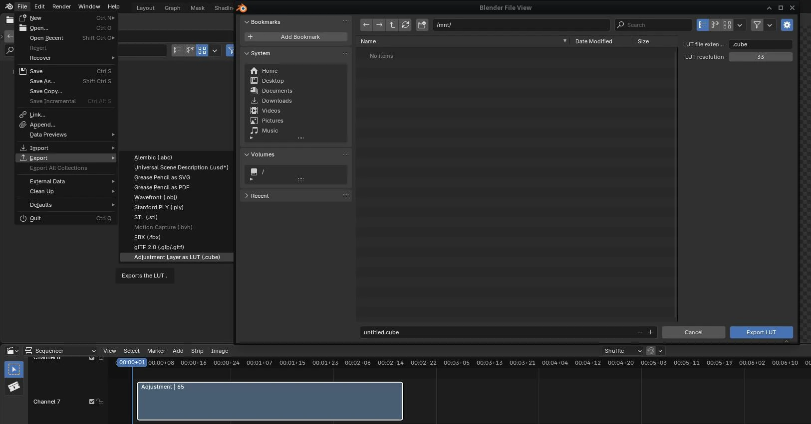
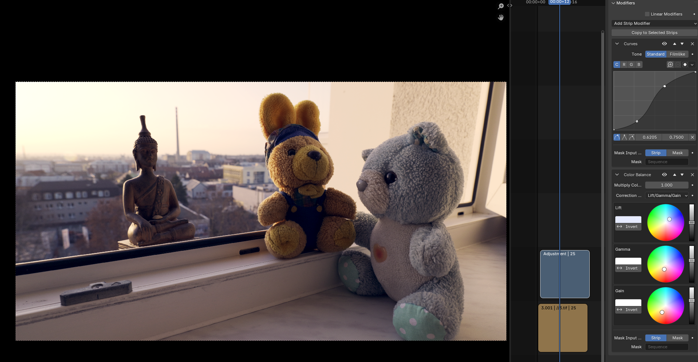
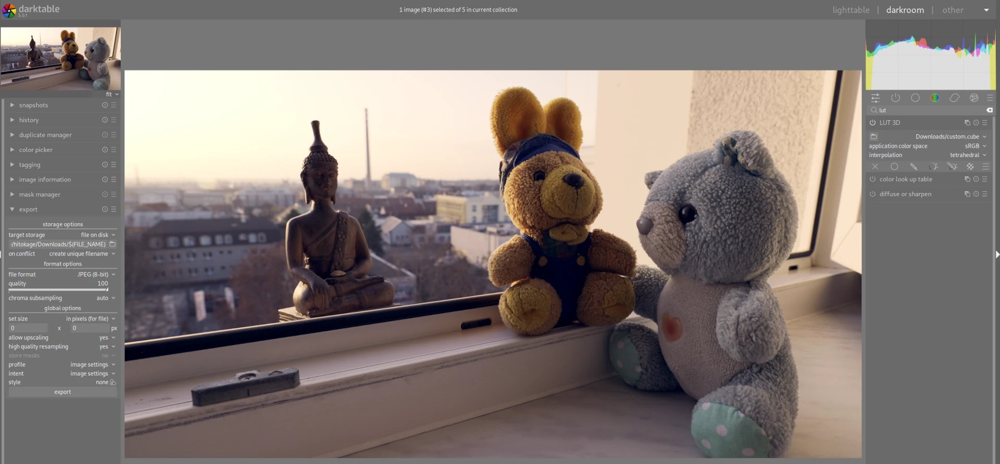
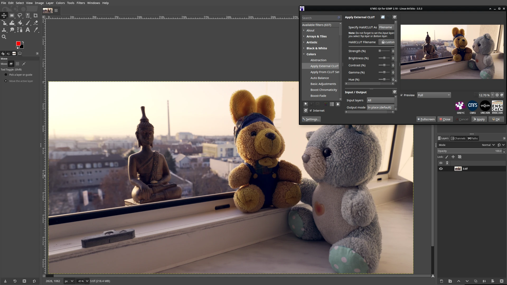
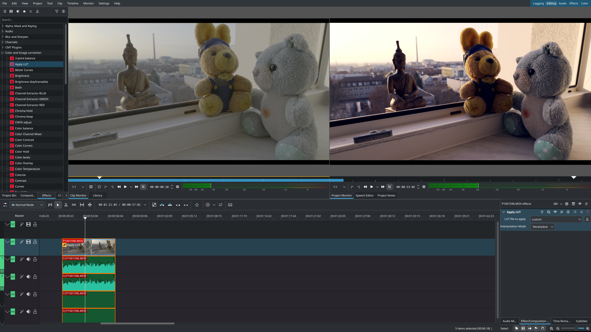

# Blender LUT Exporter & Importer
This add-on enables export of the color adjustment in Blender VSE (Video Sequence Editor) into a .cube LUT file and vice versa.

## LUT
LUT (Look-up Table) files contain the conversion data for transforming the colors of video or image into different colors. 
This is often useful when converting between different color profiles. 
For example, when a footage is recorded in a logarithmic profile, having dull and low-contrast look, LUT is used to restore the natural looking colors. 
LUT can be also used to simulate a different device look for the video. 
Another use is to save a color grading present for the given input so that it can be reused again in another project or even in a completely different editing software. 
Since LUT convert one color value to another, it depends on the input. 
When using a LUT to reproduce the same look, for example, copying the same color grading preset, the input data need to be in the same color profile as the ones used when creating the LUT. 
For example, using the same camera and the same color profile settings such as logarithmic (V-Log, N-Log, S-Log, ...) etc.
LUT also cannot reproduce any filters which process the images by blocks like blur, sharpening, etc.

## Installation
The easiest way is to go to the Blender top menu, Edit, Preferences, Get Extensions and type LUT Exporter.
The extension is published at the official [database](https://extensions.blender.org/approval-queue/blender-lut-exporter).
When installing manually, download the archive in [releases](https://github.com/ichlubna/BlenderLUTExporter/releases), open Blender, go to the top menu, Edit, Preferences, Get Extensions, click the top right down arrow, click Install from Disk, and select the downloaded file. 
Then enable the add-on by clicking the checkbox at its name. 

## Usage
How to create and export LUT file in Blender? 
Create the adjustment layer in VSE with the desired color grading. 
Go to the top menu under File and Export and click the Adjustment Layer as LUT button. 
Fill output file with `.cube` extension. 
Set the desired resolution. 
Standard is resolution of 33 which outputs 33x33x33 LUT file. 
Larger resolution leads to slower export and larger file. 
The higher the resolution, the more precisely does the LUT replicate the original colors. 
The reference display and view transform in the export dialogue is the color transform that is expected in the input strip.




The import is straightforward via the Import menu.
The imported file is added as a new Adjustment layer in the active video sequence editor.

## How to use the exported LUT
The LUT can be imported using the inbuilt import operator, similar to the export.
Another option is to use an importer addon like [this one](https://github.com/tin2tin/3D_LUT_Import_VSE).
LUT can be also imported in Blender manually and used in the standard workflow.
LUT files are stored in the Blender [data path](https://docs.blender.org/manual/en/latest/advanced/blender_directory_layout.html#:~:text=an%20application%20template.-,./datafiles,-Data%20files%20loaded). 
In the `datafiles/colormanagement/`, insert the `.cube` LUT file into the `luts` directory.
Then edit the `config.ocio` file and in the `displays` section, add:
```
    - !<View> {name: LUT_NAME, colorspace: Rec.1886}
```

In the `colorspaces` section, add:
```
  - !<ColorSpace>
    name: LUT_NAME
    aliases: [LUT_NAME]
    family: 
    equalitygroup:
    bitdepth: 32f
    description: |
      LUT_DESCRIPTION
    isdata: false
    allocation: uniform
    to_scene_reference: !<GroupTransform>
      children:
        - !<FileTransform> {src: LUT_FILE.cube}
        - !<ColorSpaceTransform> {src: Linear CIE-XYZ I-E, dst: Rec.1886, direction: inverse}    
```

Change the LUT_* variables to your own ones. 
Make sure to keep the same indentation as the rest of the file.
In the VSE, import your video, select the strip, to to the right panel, open Source folded menu, and select the Color Space marking your LUT.


### Other software

A video frame captured in V-Log is used in the comparison.  
  
The setting in Blender with the adjustment layer:  


The exported LUT used in Darktable:  


The exported LUT used in GIMP:  


The exported LUT used in Kdenlive:  


## Principle
This add-on internally copies the adjustment layer into a new scene, adds a color strip under it, changes the color value to iterate over all necessary colors in the LUT, renders the scene, reads the adjusted color, and stores this into the LUT file. 
The LUT file contains information about the mapping of input color to the output color RGB vector.
The input vector is not present in the file as it is implicitly defined. 
This is an example of an identity LUT:

```
LUT_3D_SIZE 3

0.0 0.0 0.0
0.5 0.0 0.0
1.0 0.0 0.0
0.0 0.5 0.0
0.5 0.5 0.0
1.0 0.5 0.0
0.0 1.0 0.0
0.5 1.0 0.0
1.0 1.0 0.0
0.0 0.0 0.5
0.5 0.0 0.5
1.0 0.0 0.5
0.0 0.5 0.5
0.5 0.5 0.5
1.0 0.5 0.5
0.0 1.0 0.5
0.5 1.0 0.5
1.0 1.0 0.5
0.0 0.0 1.0
0.5 0.0 1.0
1.0 0.0 1.0
0.0 0.5 1.0
0.5 0.5 1.0
1.0 0.5 1.0
0.0 1.0 1.0
0.5 1.0 1.0
1.0 1.0 1.0
```

This LUT does nothing and keeps the colors the same. 
Each row represents an output color vector. 
The order of the colors is always by increasing the channels starting with red increasing by the given step, following by green and blue, so that all combinations are defined.
The values are normalized. 
The step is deduced by the resolution of the LUT which is defined at the beginning. 
The total number of the colors is then SIZE^3. 
The colors which are not covered in the LUT are interpolated from the nearest defined ones. 

A new adjustment layer with Compositor modifier is created during import. 
The LUT file is converted into a 2D texture containing SIZE blocks with per-block resolution of SIZE^2.
The compositor nodes use trilinear interpolation and sample the texture using the input RGB vector as the index.
